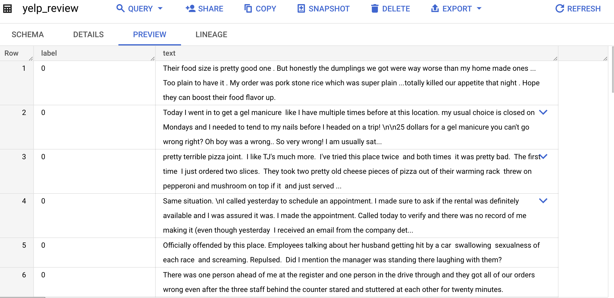
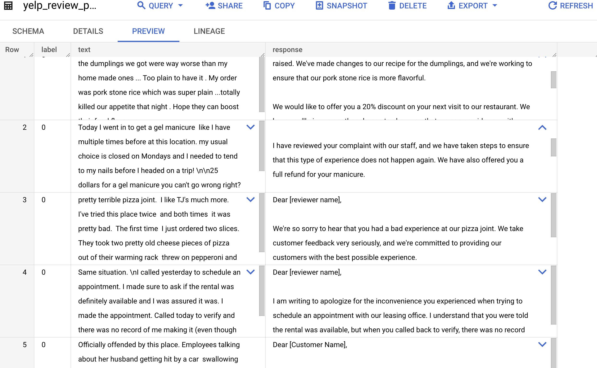

# Vertex Generative AI inference via dataproc serverless

This repository contains an example that demonstrate how to run
[Generative AI](https://cloud.google.com/ai/generative-ai), powered by [Vertex AI](https://cloud.google.com/vertex-ai) via python SPARK UDFs using 
 [dataproc serverless SPARK]( https://cloud.google.com/dataproc-serverless)  


## Use case
The example uses the [Yelp reviews dataset](https://www.tensorflow.org/datasets/community_catalog/huggingface/yelp_review_full). The Yelp reviews dataset consists of 5,000 reviews from Yelp. We use PaLm-2 via SPARK to generate a new column with a customized customer response. It uses the text sentiment to select a prompt  (e.g. offers a voucher or discount if the review is bad)

## Sample outputs

**Original dataset:**



**Augmented dataset with LLM output:**



## Running the code

1. Select or create a Google Cloud project, and enable the required APIs.

2. Create a service account with enough permissions to interact with the different services (BigQuery, dataproc spark, Vertex AI).

3. Open `Cloud shell` and clone this repository

4. Edit the `build_dataproc_image.sh` file and specify:
```bash
PROJECT_ID="TO_DO_DEVELOPER"
GCP_REGION="TO_DO_DEVELOPER"
```
5. Build a custom dataproc image that contains the Vertex AI python SDK
```bash
build_dataproc_image.sh
```
6. Edit the `launch_bq_loader.sh` file and specify:

```bash
FILE_NAME="TO_DO_DEVELOPER"
NUM_SAMPLES="TO_DO_DEVELOPER"
BQ_TABLE_FQN="TO_DO_DEVELOPER"
TEMP_GCS_BUCKET="TO_DO_DEVELOPER"
```

7. Load data into BigQuery:

```bash
launch_bq_loader.sh
```

8. Edit the `launch_job.sh` file and specify:

```bash
PROJECT_ID="TO_DO_DEVELOPER"
GCP_REGION="TO_DO_DEVELOPER"
SUBNET="TO_DO_DEVELOPER"
UMSA_FQN="TO_DO_DEVELOPER"
DEPS_BUCKET="TO_DO_DEVELOPER"
BQ_TABLE_FQN="TO_DO_DEVELOPER"
```

9. Launch the dataproc serverless job
```bash
launch_job.sh
```