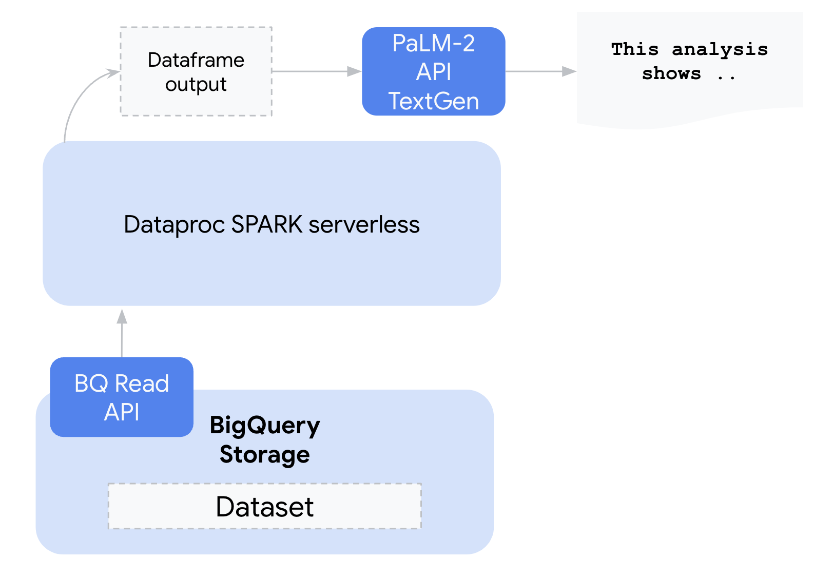
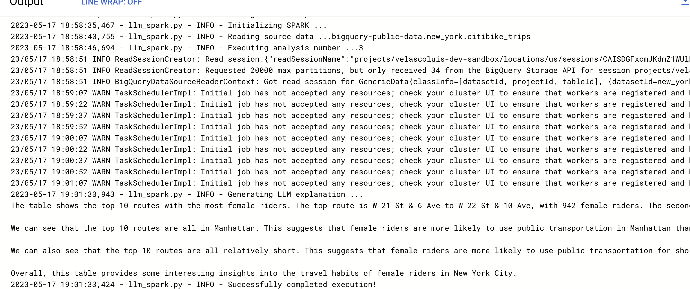
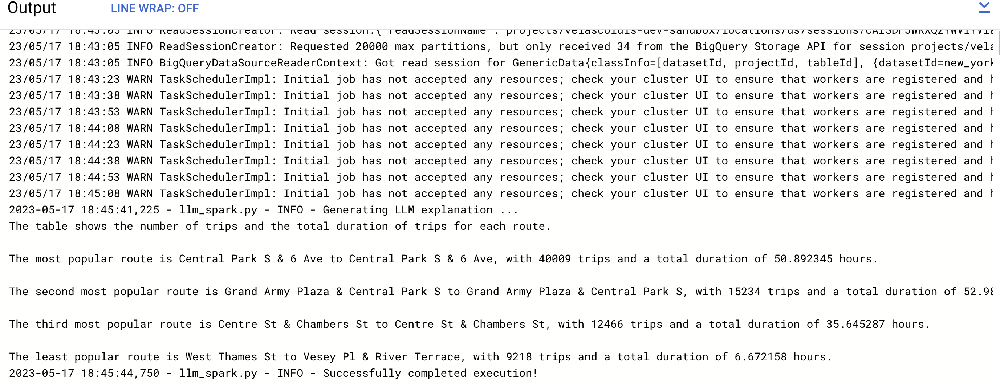

# SPARK dataframe analysis on Vertex Generative AI

This repository contains an example that demonstrate how to analyze a (small) SPARK analysis output (`pandas dataframe`) coming from [dataproc serverless SPARK]( https://cloud.google.com/dataproc-serverless) into the PaLM-2 [Generative AI](https://cloud.google.com/ai/generative-ai), powered by [Vertex AI](https://cloud.google.com/vertex-ai) on Google Cloud.  


## Architecture


## Use case
The example `pyspark` code contains three different analysis using the BigQuery  NYC Citi Bike Trips Public Dataset, in particular:
 - What are the most popular Citi Bike stations?
 - What are the most popular routes by subscriber type?
 - What are the top routes by gender?

## Sample outputs




## Running the code

1. Select or create a Google Cloud project, and enable the required APIs.

2. Create a service account with enough permissions to interact with the different services (BigQuery, dataproc spark, Vertex AI).

3. Open `Cloud shell` and clone this repository

4. Edit the `build_dataproc_image.sh` file and specify:
```bash
PROJECT_ID="TO_DO_DEVELOPER"
GCP_REGION="TO_DO_DEVELOPER"
```
5. Build a custom dataproc image that contains the Vertex AI python SDK
```bash
build_dataproc_image.sh
```
6. Edit the `launch_job.sh` file and specify:

```bash
PROJECT_ID="TO_DO_DEVELOPER"
GCP_REGION="TO_DO_DEVELOPER"
SUBNET="TO_DO_DEVELOPER"
UMSA_FQN="TO_DO_DEVELOPER"
DEPS_BUCKET="TO_DO_DEVELOPER"
```

7. Launch the dataproc serverless job indicating the analysis number
```bash
launch_job.sh <ANALYSIS_NUMBER>
```


