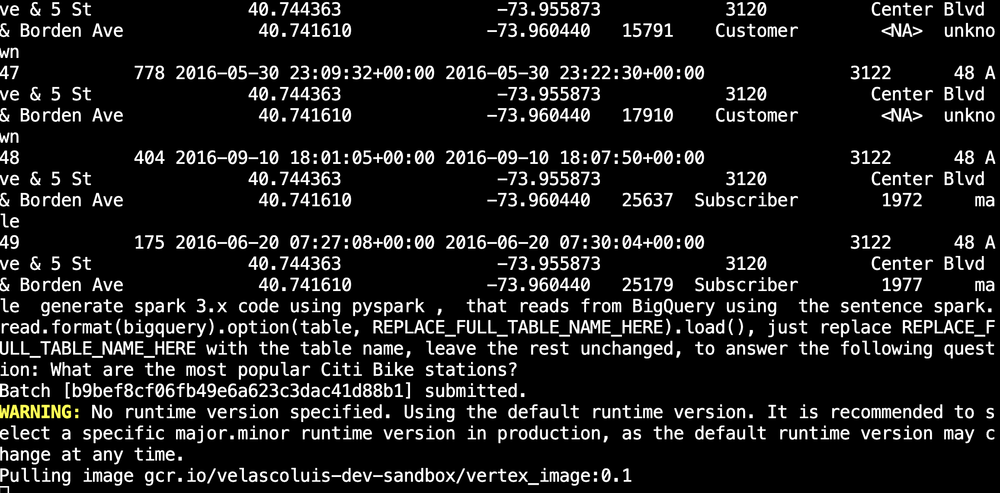
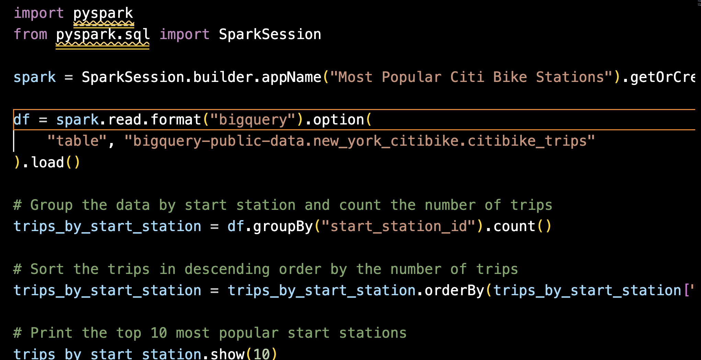
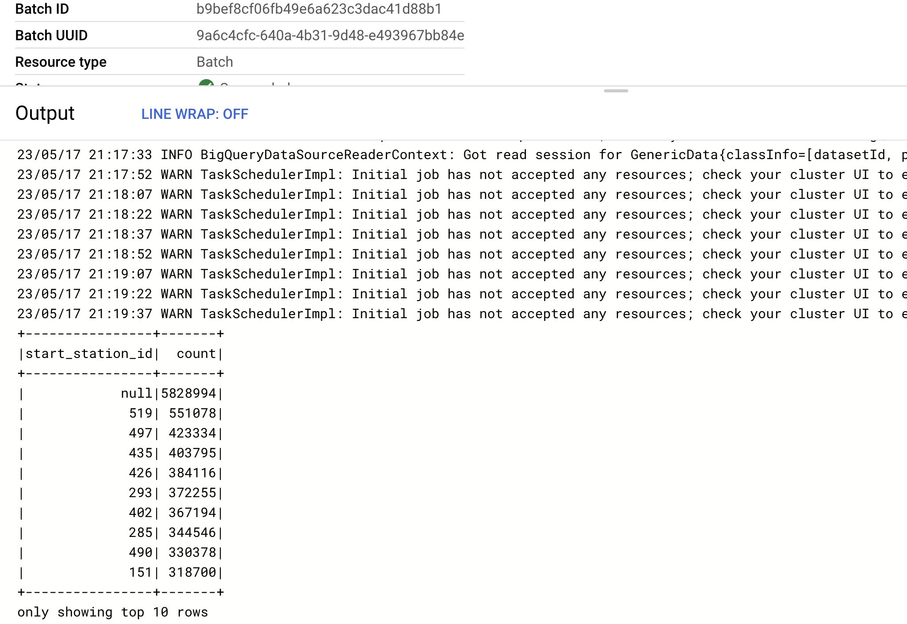

# SPARK code generation Vertex Generative AI

This repository contains an example that demonstrate how to generate `pyspark` code using PaLM-2 [Generative AI](https://cloud.google.com/ai/generative-ai), powered by [Vertex AI](https://cloud.google.com/vertex-ai) and run it using 
[dataproc serverless SPARK]( https://cloud.google.com/dataproc-serverless) 

## Sample outputs
Initial call:

```bash
python3  src/code_gen.py --bq_table_full_name="bigquery-public-data.new_york.citibike_trips" --question="What are the most popular Citi Bike stations?"
```
* Execution - see prompt design:

* Code generated:

* dataproc serverless execution log:


